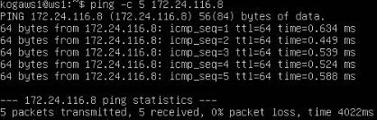
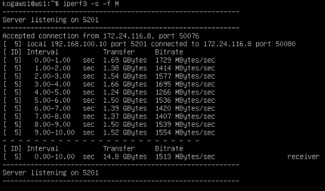
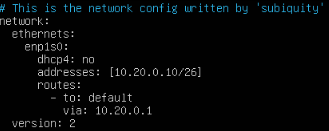
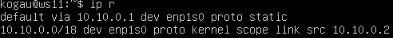
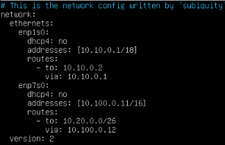

## Part 1. Инструмент **ipcalc**

1.   
Устанавливаем инструмент ipcalc(sudo apt install ipcalc)

2.   
- ввел команду ipcalc 192.167.38.54/13  
- адрес сети - 192.160.0.0/13

3.   
    - ввел команду ipcalc 192.167.38.54/13  
    - 255.255.255.0 = префиксная /24
    - 255.255.255.0 = в двоичной 11111111.11111110.00000000.00000000

4.   
    - ввел команду ipcalc /15  
    - /15 = обычная 255.254.0.0
    - /15 = двоичная 11111111.11111110.00000000.00000000
  
5. 
    - 11111111.11111111.11111111.11110000 перевод в маску 255.255.255.240
    - 11111111.11111111.11111111.11110000 = префикс /28

6.   
    - ввел команду ipcalc  12.167.38.4/8
    - Минимальный хост: 12.0.0.1
    - Максимальный хост: 12.255.255.254

7.   
    - Маска 11111111.11111111.00000000.00000000 это префикс /16  
    - ввел команду ipcalc  12.167.38.4/16
    - Минимальный хост: 12.167.0.1
    - Максимальный хост: 12.167.255.254

8. 
    - ввел команду ipcalc  12.167.38.4/255.255.254.0
    - Минимальный хост: 12.167.38.1
    - Максимальный хост: 12.167.39.254

9. 
    - ввел команду ipcalc 12.167.38.4/4
    - Минимальный хост: 0.0.0.1
    - Максимальный хост: 15.255.255.254

10. - 194.34.23.100 - этот ip не является частью диапозона
    - 127.0.0.2 - ip принадлжеит диапозону
    - 127.1.0.1 - ip принадлжеит диапозону
    - 128.0.0.1 - этот ip не является частью диапозона

11. 
    - частные ip адреса

12. - 10.0.0.45 - частный
    - 134.43.0.2 - публичный
    - 192.168.4.2 - частный
    - 172.20.250.4 - частный
    - 172.0.2.1 - публичный
    - 192.172.0.1 - публичный
    - 172.68.0.2 - частный
    - 172.16.255.255 - частный
    - 10.10.10.10 - частный
    - 192.169.168.1 - публичный

13. - диапозон от 10.10.0.1 до  10.10.63.254
    - 10.0.0.1 - не входит в диапозон 
    - 10.10.0.2 - входит в диапозон
    - 10.10.10.10 - входит в диапозон
    - 10.10.100.1 - входит в диапозон
    - 10.10.1.255 - не входит в диапозон

## Part 2. Статическая маршрутизация между двумя машинами

1. 
   
    - ip a для ws1 и ws2

2. 
    - Измененный конфиг для ws1

3. 
    - Измененный конфиг для ws2

4. 
   
    - sudo netplan apply

5. 
   
    - ввёл команду sudo ip route add 172.24.116.8 dev enp1s0, после чего успешно пропинговал ws2

6. 
   
    - ввёл команду sudo ip r add 192.168.100.10 dev enp1s0, после чего успешно пропинговал ws1

7. 
   
    - изменил конфигурационный файл для ws1 и ws2, добавив статическую маршрутизацию с помощью routes

8. 
   
    - пинг от ws1 -> ws2 и пинг от ws2 -> ws1

## Part 3. Утилита **iperf3**

1. Перевод:
    - 8 Mbps (мегабит в сек) = 1 MB/s (мегабайт в сек)
    - 100 MB/s (мегабайт в сек) = 819200 Kbsp (килобит в сек)
    - 1 Gbps (гигабит в сек) = 1024 Mbps (мегабит в сек)

2.  - sudo apt install iperf3

3. 
   
    - на ws1 iperf3 -s -f M(для отображения в МегаБайтах)
    - на ws2 iperf3 -c 192.168.100.10(для подключения)

## Part 4. Сетевой экран

1. 
   
    - F - очищает все правила и цепочки 
    - X - удаляет пользовательские цепочки
    - A - добовляет правило в конец указанной цепочки
    - p - указывает протокол для правила
    - dport - указывает порт для трафика
    - j - цель для правила 
    - icmp-type - для указания типо ICMP-сообщения

2. 
    - вызов команды sudo chmod +x /etc/firewall.sh
    - вызов команды sudo bash /etc/firewall.sh
    - вызов команды iptable -L для просмотра правил

3. На ws1 в начале применяется запрещающее правило (DROP), а затем разрешающее правило (ACCEPT), сначала блокируется весь трафик, а затем разрешается только определенный, весь трафик будет отвергнут, если не соответствует определенным правилам.

4. На ws2 в начале применяется разрешающее правило (ACCEPT), а затем запрещающее правило (DROP), сначала разрешается весь трафик, а затем блокируется только определенный , весь трафик будет принят, если не соответствует определенным правилам.

5. 
   
    - проверяем пинг на ws1 к ws2 (пингует)
    - проверяем пинг на ws2 к ws1 (не пингует)

6. 
    - утилитой nmap проверяем Host is up

## Part 5. Статическая маршрутизация сети

sudo systemctl restart systemd-networkd - для перезапуска сервиса сети

1. 
    - конфиг для ws11
    
2. 
    - конфиг для ws21

3. 
    - конфиг для ws22

4. 
    - конфиг для r1

5. 
    - конфиг для r2

6. 
   
   
   
   
    - ip -4 a для всех машин

7. 
    - ping ws22 с ws21

8. 
    - ping r1 c ws11

9. 
   
    - команда на r1 и r2

10. 
    - убрал # для ipv4

11. 
    - убрал # для ipv4

12. 
    
    
    - измененный конфиги 

13. 
    
    
    - ip r для всех машин

14. 
    
    - tcpdump -tn -i enp1s0

15. 
    
    - измененные конфигурации 

16. 
    
    - ip r для r1 и r2

17. 
    - Маршрут 10.10.0.0/18 является более конкретным, чем 0.0.0.0/0, т.к охватывает более узкий диапозон, и поэтому маршрут по умолочанию не будет использоваться, так как есть более точный маршрут для этой сети. Это позволяет более точно маршрутизировать пакеты.

18. 
    - tcpdump -tnv -i enp1s0

19. 
    - traceroute 10.20.0.10

20. Утилита traceroute использует принцип работы сетевого протокола ICMP (Internet Control Message Protocol) для построения пути от отправителя до получателя. Она отправляет серию пакетов с увеличивающимся значением TTL (Time To Live) и отслеживает ответы от промежуточных маршрутизаторов на пути к целевому хосту.

21. 
    
    - на r1 sudo tcpdump -n -i enp1s0 icmp
    - на ws11 ping -c 1 10.30.0.111
    - ICMP -  сетевой протокол, в основном ICMP используется для передачи сообщений об ошибках и других исключительных ситуациях, возникших при передаче данных.

## Part 6. Динамическая настройка IP с помощью **DHCP**

1. 
    - изменил конфигурационый файл 

2. 
    - изменил resolv.conf

3. 
    - перезапуск службы DHCP systemctl restart isc-dhcp-server

4. 
    - на ws21: ip a и пинг ws21 -> ws22

5. 
    - изменил конфиг для ws11

6. 
    - конфиг для r1
    
7. 
    - изменил файл resolv для r1

8. 
   
    - на ws21: ip a и пинг ws21 -> ws22

9. 
    - освобождаем IP-адрес DHCP-клиента с помощью команды sudo dhclient -r и получаем новый IP-адрес с помощью DHCP с помощью команды sudo dhclient -v

10. 
    - ip a после обновления

11. 
    - Настройка конфигурации службы DHCP (адрес маршрутизатора по-умолчанию, DNS-сервер, адрес внутренней сети, привязка к MAC-адресу)
    - Клиент протокола динамической конфигурации хоста (команда dhclient) для обновления или освобождения IP-адреса

## Part 7. **NAT**

1. 
   
    - изменил конфиги на ws22 и r1

2. 
   
    - запустил веб-сервер apache2

3. 
    - добовляем в firewall правила по заданию

4. 
    - запускаем firewall 

5. 
    - с r1 не пингуется ws22

6. 
    - Добавили в firewall правило для обработки входящих icmp пакетов

7. 
    - с r1 пингуется ws22 

8. 
    - добавляем в firewall следущие правила

9. 
    - на ws22 telnet 10.100.0.12 8080

10. 
    - на r1 telnet 10.100.0.11 80

## Part 8. Дополнительно. Знакомство с **SSH Tunnels**

1. 
    - на ws22 изменили конфигурацию apache2

2. 
    - с помощью команды ssh -L 8080:localhost:80 10.20.0.15 подключаемся к ws22 с ws21

3. 
    - физически находясь на ws21, а в терминале на ws22, проверяем через telnet сработало ли подключение

4. 
    - с ws11 подключаемся к ws22 ssh -R 8080:localhost:80 10.20.0.20

5. 
    - проверяем через telnet сработало ли подключение